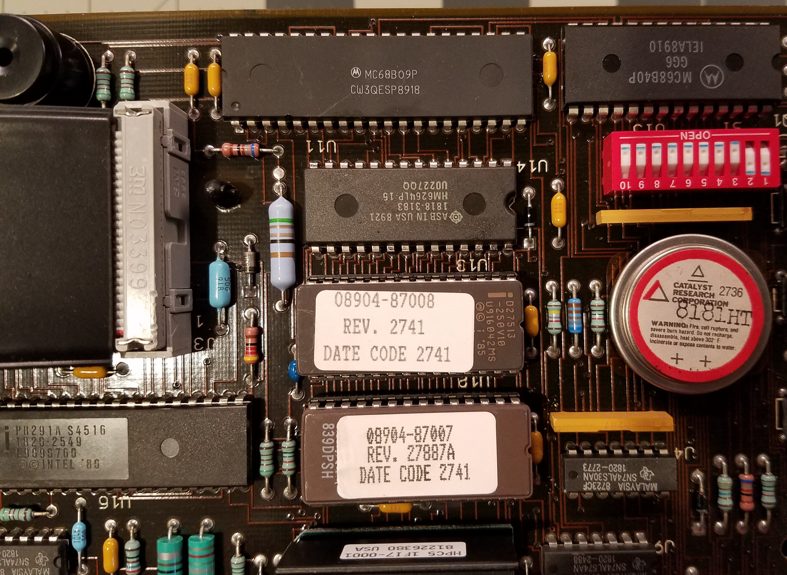
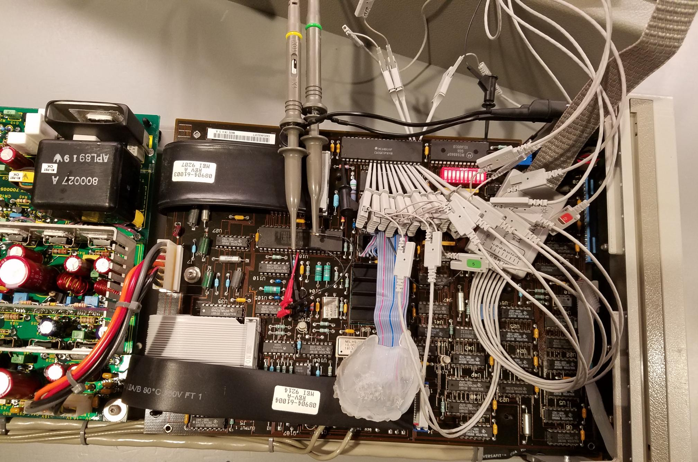

# HP 8904A Multifunction Synthesizer Patched Firmware for Stable HP-IB (GPIB) Communications

| **Serial Prefix** | **A2U12 Label** | **Status** |
|-|-|-|
| 2942A and below | <08904‑87010 | Affected, upgrade to patched firmware [a2u12_fix.bin](a2u12_fix.bin) |
| 2942A and below | 08904‑87010 | Official fixed firmware (contact me if you have this!) |
| 2948A and above| 08904‑87011+ | Unaffected, new hardware with incompatible firmware |

## The issue with stock firmware



HP 8904A Multifunction Synthesizers with **serial number prefixes below 2948A** and **A2U12 firmware with label below 08904-87010** have known issues, as stated in section 7-3 of the [HP 8904A service manual](https://www.keysight.com/us/en/assets/9018-40471/reference-guides/9018-40471.pdf), which are resolved by upgrading A2U12 to 08904-87010. A2U12 EPROM is a AM27C256.

One issue is HP-IB stalls after a series of commands, typically ranging from a few hundred to thousand commands, at which point HP-IB is unusable until power cycling (the unit otherwise functions normally). These stalls will happen regardless of how long a delay is placed between commands, making reliable unmonitored automation impossible.

While firmware 08904-87010 resolves the HP-IB issue, support for the 8904A ended May 1, 2007, so Keysight will not provide the firmware. I have been unable to locate firmware dumps for 08904-87010 online, and firmware above is only compatible with hardware having serial number prefixes 2948A and greater.

## The solution

I have a 8904A with serial prefix between 2737A and 2942A, which has A2U12 firmware 08904-87007 that resolves issues from older revisions but has the HP-IB stall problem. Using this as a starting point, I performed several rounds of experiments and candidate fixes proposed through generative AI to identify two bugs and a firmware patch that has yielded stable HP-IB communications.

## Details

### The bugs

Two HP-IB bugs have been identified in A2U12 firmware 08904-87007 that result in stalls.

The most severe bug involves a race condition where IRQ can be called during a 16-bit read-modify-write, which results in most stalls. See details under "Verified IRQ-Latch Loss Window" in [overview.md](overview.md).

The second bug is due to reading registers from the 8291A GPIB IC in the incorrect order. ISR1 is read before ISR2 in the 08904-87007 firmware, but the [datasheet flow diagram on page 18](<datasheets/Intel P8291A GPIB Talker,Listener.pdf>) recommends ISR2 be read first. This bug was actually identified before the IRQ race bug, but only found to be important after the first bug was patched, as it occurs less frequently.

### Methodology

Binary dumps of the original firmware for A2U12 (label 08904-87007, [a2u12.bin](a2u12.bin)) and A2U13 (label 08904-87008, [a2u13.bin](a2u13.bin)) were disassembled with [unidasm](https://github.com/mamedev/mame). These disassembly listings have misaligned segments and data like strings improperly decoded as instructions, but this did not end up being a problem. More importantly, the disassembly listing gives us a way to insert comments in the raw code. The service manual only mentions the need to change A2U12 to resolve issues, providing an existence proof that A2U13 need not be modified, but the code is included in analysis in case it contains anything relevant to the understanding and tracing of the bug.

I used a combination of Opus 4.6 with high effort and GPT 5.4 with xhigh effort throughout.

#### Biting more than can be chewed

I initially fed Opus 4.6 a few hardware details, the disassembly listings, and details about the problem to solve.

```
I have an HP 8904A with serial number having a prefix 2940A.
It uses a Motorola 6809 (marked MC68B09P)
A2U12 is a AM27256 EPROM (256 kBit) having firmware 08904-87007. 
There is another EPROM A2U13 that is an Intel D27513, paged addressed 512 K (4 x 16k x 8).
There is also A2U14 SRAM HM6264LP-15, which is 8k x 8 (64kbit).

The A2U12 firmware version 08904-87007 is known to have GPIB problems that are resolved in firmware 08904-87010. The service manual states when used with HP-IB controllers which process HP-IB commands very fast, the instrument may hang up the HP-IB when the instrument is talker. This problem can be corrected by upgrading A2U12 to 08904-87010. This is described on page 7-2 (page 50 of PDF) in the service manual https://www.emctest.it/public/pages/strumentazione/elenco/Agilent%20-%20HP/8904A%20-%20Multifunction%20Synthesizer/Manuali/8904A%20Multifunction%20Synthesizer%20-%20Service%20Manual.pdf

The assembly for A2U12 firmware 08904-87007 is located in a2u12.asm
Can you determine what may be the bug in this firmware?
```

This was an overly-optimistic attempt to see if a bug could be identified with minimal effort on my part. This proved to be a waste of time, with plausible sounding leads, but Opus made a number of hardware assumptions which I had to progressively correct. I provided more details, such as datasheets and wiring details I traced out (there are no schematics for the HP 8904A). I went through several rounds of creating test ROMs with candidate fixes, and I was close to filling the 1M context when I decided to have a summary made of findings so I could transfer knowledge to a new context.

The scripts [checksum.py](checksum.py) (ensures a ROM will pass the checksum test) and [make_bin.py](make_bin.py) (create a binary from a disassembly listing) were created automatically as part of creating test ROMs.

The findings summary and scripts created were useful, but fundamentally a new context would have to parse through the large disassembly listings again to gain understanding of the base firmware. This is a slow process and quickly fills the new context, making requests expensive. I went through more rounds with Opus 4.6 and GPT 5.4, and periodically asked to review prior assumptions or ask the LLM if it was lost (it would admit when directly asked). While lots new experiments were being proposed, it felt like a time sink with no clear progress, so a new approach was needed.

#### Investing in understanding

In a fresh Opus 4.6 context I provided as much detail about the hardware and firmware structure upfront. I edited the findings from the previous rounds to help with bootstrapping, but removed anything that could be questionable, or labeled sections as needing verification. I did not mention anything about HP-IB bugs, and my first task to Opus was to understand the disassembly listings and insert comments; start with marking out high-level structure, identify functions, and provide an overview at the top, while avoiding assumptions or at least labeling comments as tentative. I had GPT 5.4 review, correct, and add comments with a similar prompt. Then I called out the HP-IB features, requesting that be analyzed and commented in more detail, as well as any surrounding code that calls HP-IB functions.

This investment in providing as much detail as possible up front helps ground the LLM and avoid assumptions or hallucinations. The comments added to the directory listing can then be used in fresh contexts to help navigate the code without having to digest it all over again. Only after this did I start a new context and describe the HP-IB problem that needs to be debugged and have a permanent fix created for.

#### Debugging process



Understanding and debugging the code involved taking various measurements before and during an HP-IB stall. This included voltages HP-IB lines and various IC pins, and what proved most useful, traces of address sequences around the calls to the GPIB chip. Several test scripts were created (by me, no AI) that would send repeated command sequences over GPIB to the 8904A and ultimately result in stall. A logic analyzer was attached to the address lines of the CPU, a Motorola MC8609, and triggered on certain addresses. A sequence of addresses before and mostly after the trigger, and multiple unique sequences were captured for successful and failed commands. This was a time consuming process, which involved fine-tuning the triggering and command generation details so commands could be sent as fast as possible (increasing the failure rate) while ensuring the triggers happened when desired.

These experiments were performed first on stock firmware, then on test ROMs.

#### Continuing work

While I have tested the patched firmware with hundreds of thousands of commands without failure, it is possible issues remain. [overview.md](overview.md) serves as the primary document for future work, providing a description of the problem, what is known, what has been tested, and what questions remain. You can clone this repository, direct an LLM to that file, describe the problem you are seeing, and ask what to try next.
